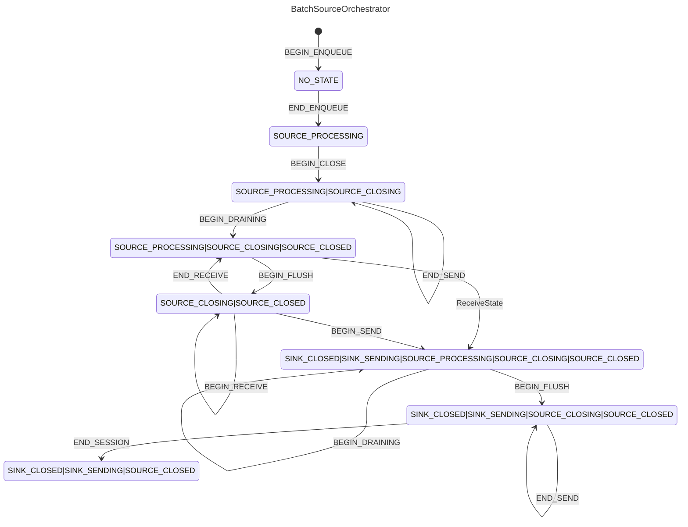
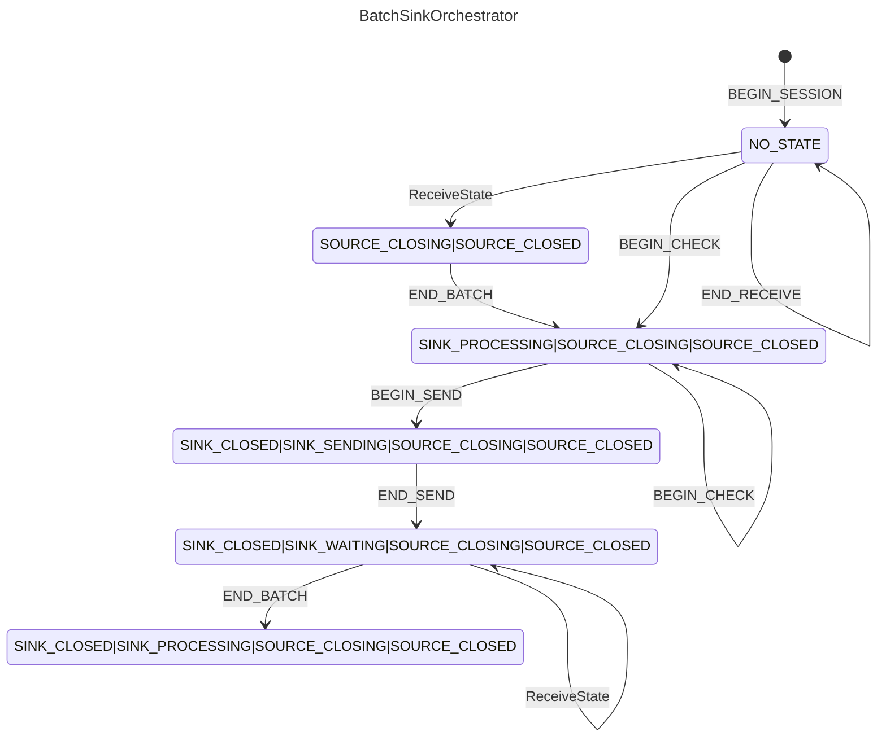

</img>

# go-car-mirror

[](https://github.com/fission-codes/go-car-mirror/actions/workflows/main.yml)
[](https://github.com/fission-codes/blob/master/LICENSE)
[](https://fission.codes)
[](https://discord.gg/zAQBDEq)
[](https://talk.fission.codes)

🚧 WIP 🚧

Generic Go implementation of [CAR Mirror](https://github.com/fission-codes/spec/tree/main/car-pool).

Will be used in [kubo-car-mirror](https://github.com/fission-codes/kubo-car-mirror) when complete.

## Building

```
make build
```

## Testing

```
make test
```

## Logging

```
export GOLOG_LOG_LEVEL="go-car-mirror=debug"
```


## State Diagrams

These diagrams are generated when running `make test`.  See the output in `testdata/state-diagrams.md`.  Currently you have to copy any markup into this README manually.

### TestMockTransferToEmptyStoreSingleBatchNoDelay




